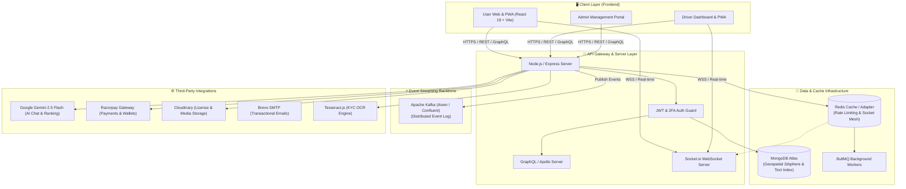
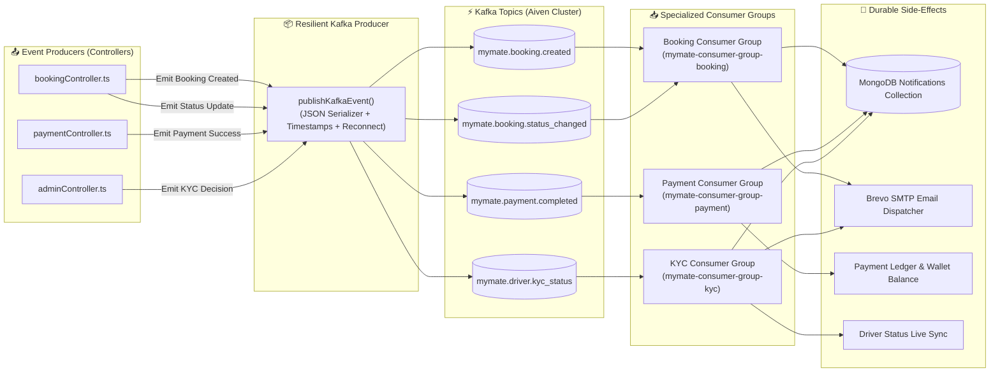
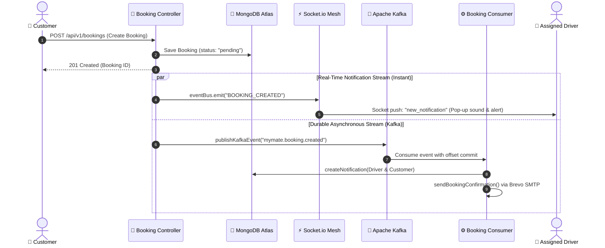
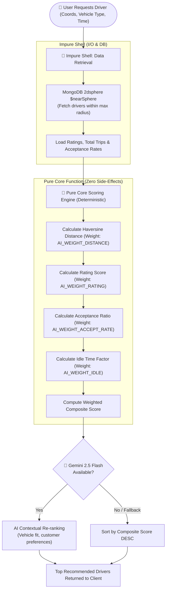
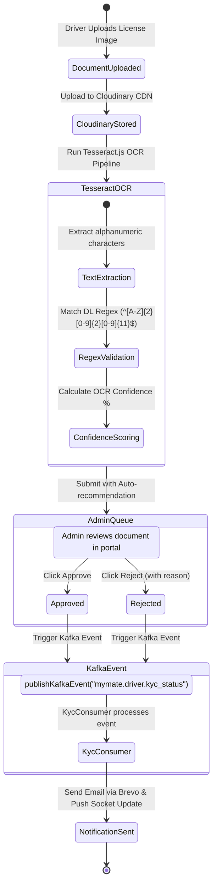

# MyMate - Local Driver Hiring Platform

## 📖 Overview
**MyMate** is a production-grade, enterprise-ready full-stack web application designed to connect users with verified local drivers for on-demand rides, temporary hiring, and long-term contracts. The platform emphasizes real-time state synchronization, AI-powered driver matching, fraud prevention, and a resilient **Apache Kafka event-driven messaging architecture**.

---

## 🏛️ System Architecture Diagrams

### 1. High-Level Distributed System Architecture


---

### 2. Apache Kafka Event-Driven Architecture & Consumer Groups


---

### 3. Dual-Stream Booking Execution Flow (Real-Time vs Asynchronous)


---

### 4. AI Driver Matchmaking Pipeline (Pure Core / Impure Shell)


---

### 5. Automated Driver KYC OCR & Verification Lifecycle


---

## ⚡ Apache Kafka Event-Driven Messaging Layer

MyMate employs **Apache Kafka** (`kafkajs`) to decouple critical HTTP request/response flows from asynchronous, durable background tasks (emails, notifications, audit trails, and reconciliation).

### Architecture Separation: Real-Time vs Durable Async
- **Local WebSocket Pushes (`EventEmitter` + `Socket.io`)**: Handles zero-latency UI updates to active client sessions (e.g. driver assigned, status banner changed).
- **Kafka Consumers (`kafkajs`)**: Handles durable, retryable side-effects (database notifications, transactional emails via Brevo/SMTP, financial ledger logging) with independent consumer group offsets.

### Kafka Topics & Schemas
| Topic | Key | Payload Contents | Handled By |
|---|---|---|---|
| `mymate.booking.created` | `bookingId` | `primaryBooking`, `driverId`, `user`, `hireType`, `isRecurring` | `bookingConsumer` |
| `mymate.booking.status_changed` | `bookingId` | `booking`, `user`, `driver`, `status` | `bookingConsumer` |
| `mymate.payment.completed` | `bookingId` / `orderId` | `bookingId`, `driverId`, `totalAmount`, `driverAmount`, `paymentMethod` | `paymentConsumer` |
| `mymate.driver.kyc_status` | `driverId` | `driver`, `status` (`approved` / `rejected`), `reason` | `kycConsumer` |

---

## 📂 Detailed Breakdown of Pushed Kafka Files

Below is a precise explanation of the files added and updated in the Kafka integration:

### 1. Configuration & Infrastructure
- **[`backend/config/kafka.ts`](file:///c:/Users/nayak/OneDrive/Desktop/Projects/web/MyMate/backend/config/kafka.ts)**
  - Initializes the global Kafka client instance (`KafkaConfig`).
  - Supports SASL authentication (`PLAIN`, `SCRAM-SHA-256`, `SCRAM-SHA-512`) and TLS/SSL encryption.
  - Supports SSL custom certificates via local file path (`KAFKA_CA_PATH`) or direct inline environment string (`KAFKA_CA_CERT`) for zero-file cloud deployments (e.g., Render, Railway, AWS).
  - Handles environment toggle (`KAFKA_ENABLED=false`) with graceful fallback.

- **[`backend/kafka/topics.ts`](file:///c:/Users/nayak/OneDrive/Desktop/Projects/web/MyMate/backend/kafka/topics.ts)**
  - Defines strongly-typed constants for all event topics (`KAFKA_TOPICS`).
  - Exports TypeScript `KafkaTopic` union type ensuring compile-time validation for event emitters.

- **[`backend/kafka/producer.ts`](file:///c:/Users/nayak/OneDrive/Desktop/Projects/web/MyMate/backend/kafka/producer.ts)**
  - Resilient singleton producer wrapper (`publishKafkaEvent`).
  - Implements lazy connection on first message dispatch and automatic reconnection.
  - Automatically JSON-serializes payloads and appends high-precision Unix timestamps.

- **[`backend/kafka/index.ts`](file:///c:/Users/nayak/OneDrive/Desktop/Projects/web/MyMate/backend/kafka/index.ts)**
  - Master orchestrator for the messaging engine.
  - Auto-provisions required topics on cluster startup using the Kafka Admin Client (`createKafkaTopics`).
  - Boots up all specialized consumer workers in parallel and manages graceful shutdown on application exit.

### 2. Specialized Event Consumers
- **[`backend/kafka/consumers/bookingConsumer.ts`](file:///c:/Users/nayak/OneDrive/Desktop/Projects/web/MyMate/backend/kafka/consumers/bookingConsumer.ts)**
  - Subscribes to `mymate.booking.created` & `mymate.booking.status_changed` under consumer group `mymate-consumer-group-booking`.
  - Dispatches customer & driver in-app notifications and email confirmations asynchronously.

- **[`backend/kafka/consumers/paymentConsumer.ts`](file:///c:/Users/nayak/OneDrive/Desktop/Projects/web/MyMate/backend/kafka/consumers/paymentConsumer.ts)**
  - Subscribes to `mymate.payment.completed` under consumer group `mymate-consumer-group-payment`.
  - Writes audit logs and sends payment confirmation notifications to drivers and customers.

- **[`backend/kafka/consumers/kycConsumer.ts`](file:///c:/Users/nayak/OneDrive/Desktop/Projects/web/MyMate/backend/kafka/consumers/kycConsumer.ts)**
  - Subscribes to `mymate.driver.kyc_status` under consumer group `mymate-consumer-group-kyc`.
  - Sends approval/rejection emails and driver profile updates.

### 3. Controller & Lifecycle Integrations
- **[`backend/controllers/bookingController.ts`](file:///c:/Users/nayak/OneDrive/Desktop/Projects/web/MyMate/backend/controllers/bookingController.ts)**
  - Emits `BOOKING_CREATED` and `BOOKING_STATUS_CHANGED` Kafka events upon ride creation, driver acceptance, ride start, and trip completion.
- **[`backend/controllers/paymentController.ts`](file:///c:/Users/nayak/OneDrive/Desktop/Projects/web/MyMate/backend/controllers/paymentController.ts)**
  - Emits `PAYMENT_COMPLETED` Kafka events upon successful Razorpay signature verification and driver wallet crediting.
- **[`backend/controllers/adminController.ts`](file:///c:/Users/nayak/OneDrive/Desktop/Projects/web/MyMate/backend/controllers/adminController.ts)**
  - Emits `DRIVER_KYC_STATUS` Kafka events when an administrator reviews and approves/rejects driver documents.
- **[`backend/events/bookingEvents.ts`](file:///c:/Users/nayak/OneDrive/Desktop/Projects/web/MyMate/backend/events/bookingEvents.ts)**
  - Refactored to eliminate duplicate side-effects: retains **only real-time WebSocket emissions**, offloading persistent storage and email generation to Kafka.
- **[`backend/server.ts`](file:///c:/Users/nayak/OneDrive/Desktop/Projects/web/MyMate/backend/server.ts)**
  - Wires `startKafka()` during server startup.
  - Exposes live Kafka broker status on the deep `/health` endpoint.
  - Integrates `stopKafka()` into graceful termination signals (`SIGINT`, `SIGTERM`).

### 4. Testing & Verification
- **[`backend/tests/kafka.test.ts`](file:///c:/Users/nayak/OneDrive/Desktop/Projects/web/MyMate/backend/tests/kafka.test.ts)**
  - ESM-compatible Jest unit test suite using `jest.unstable_mockModule`.
  - Validates topic namespaces, producer event routing, payload structure, timestamps, and error recovery.

---

## 🤖 AI & Machine Learning Capabilities

1. **Multi-Turn AI Support Assistant (`/api/v1/ai/chat`)**
   - Built on Google Gemini (`@google/genai`) with circuit-breaker protection (Opossum).
   - Multi-turn conversation context memory, markdown rendering, and quick-action chips.

2. **Intelligent Driver Matchmaking (`/api/v1/ai/match` & `/api/v1/ai/recommend`)**
   - **Gemini Matchmaking**: Analyzes ratings, vehicle capabilities, and trip distance.
   - **Pure Functional Heuristic Engine**: Pure-core/impure-shell architecture ranking drivers deterministically with tunable weights (`AI_WEIGHT_DISTANCE`, `AI_WEIGHT_RATING`, `AI_WEIGHT_ACCEPT_RATE`, `AI_WEIGHT_IDLE`).

3. **Automated KYC OCR Verification (`/api/v1/ai/verify-kyc`)**
   - Tesseract.js OCR engine extracting details from Indian Driving Licenses with format validation and confidence scoring.

4. **Live Geospatial Demand Heatmap (`/api/v1/ai/heatmap`)**
   - MongoDB `2dsphere` geospatial aggregation calculating high-density pickup zones for driver repositioning.

---

## 🛠️ Technology Stack

| Layer | Technologies |
|---|---|
| **Frontend** | React 19, Vite, TailwindCSS v4, Framer Motion, Leaflet, Socket.io-client, React Hook Form, Zod, PWA (vite-plugin-pwa) |
| **Backend API** | Node.js, Express, TypeScript, GraphQL (Apollo Server), MongoDB (Mongoose) |
| **Messaging & Events** | **Apache Kafka** (`kafkajs`), Redis Adapter, Node.js EventEmitter, BullMQ |
| **AI & OCR** | Google Gemini API (`@google/genai`), Tesseract.js, Opossum Circuit Breakers |
| **Authentication & Security** | JWT, bcrypt, Two-Factor Authentication (2FA), Helmet, Express Rate Limit |
| **Payments & Media** | Razorpay SDK, Cloudinary, PDFKit (Invoice Generation), Brevo SMTP |
| **Observability & Docs** | Prometheus metrics, Swagger UI (`/api-docs`), Winston Logger |

---

## ⚙️ Environment Variables Guide

Configure these in `backend/.env`:

```env
# Database & Core
MONGO_URI=mongodb+srv://<user>:<password>@cluster.mongodb.net/mymate
JWT_SECRET=your_jwt_secret_key
PORT=5000
NODE_ENV=development
CLIENT_URL=http://localhost:5173

# Apache Kafka (Cloud Brokers: Aiven, Confluent, Upstash, or Local)
KAFKA_BROKERS=your-kafka-broker.aivencloud.com:13575
KAFKA_CLIENT_ID=mymate-backend
KAFKA_GROUP_ID=mymate-consumer-group
KAFKA_ENABLED=true
KAFKA_SASL_USERNAME=avnadmin
KAFKA_SASL_PASSWORD=your_sasl_password
KAFKA_SASL_MECHANISM=plain
KAFKA_SSL=true
KAFKA_CA_PATH=ca.pem
# KAFKA_CA_CERT="-----BEGIN CERTIFICATE-----\n...\n-----END CERTIFICATE-----"

# AI Configuration
GEMINI_API_KEY=your_gemini_api_key
AI_WEIGHT_DISTANCE=2
AI_WEIGHT_RATING=10
AI_WEIGHT_ACCEPT_RATE=0.5
AI_WEIGHT_IDLE=1

# Payments & Storage
RAZORPAY_KEY_ID=rzp_test_...
RAZORPAY_KEY_SECRET=your_razorpay_secret
CLOUDINARY_CLOUD_NAME=your_cloud_name
CLOUDINARY_API_KEY=your_api_key
CLOUDINARY_API_SECRET=your_api_secret

# Email (SMTP)
SMTP_HOST=smtp-relay.brevo.com
SMTP_PORT=587
SMTP_USER=your_smtp_user
SMTP_PASS=your_smtp_password
SMTP_FROM=support@mymate.com
```

---

## 🚀 Running & Testing

### 1. Run Unit & Kafka Tests
```bash
cd backend
npm test
```

### 2. Start Backend in Development
```bash
cd backend
npm run dev
```

### 3. Start Frontend in Development
```bash
cd frontend
npm run dev
```

### 4. Build for Production
```bash
# Backend build check
cd backend
npx tsc --noEmit

# Frontend production build
cd frontend
npm run build
```

---
*Built with modern web technologies, AI intelligence, and scalable distributed messaging.*
